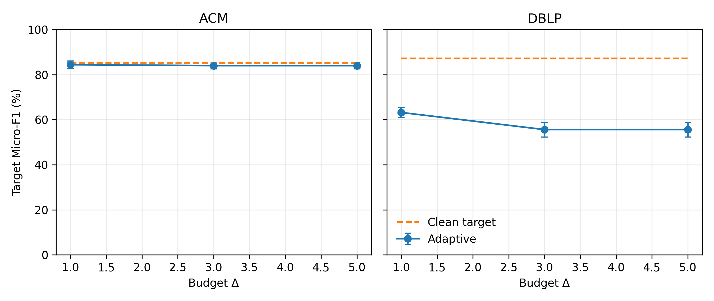

# 最终实验结果与统计分析

> 本文档由 `scripts/analyze_paper_results.py` 从逐次运行结果生成，仅报告 Micro-F1。

## 1. 实验设置

| 设置 | 取值 |
|---|---|
| 数据集 | ACM、DBLP、AMiner |
| 划分种子 $s_{split}$ | 1 |
| 训练种子 $s_{train}$ | 1–5 |
| 多种子攻击 $s_{atk}$ | 1–3 |
| Poisoning | PRBCD、HetePRBCD，$r\in\{5,15,25\}\%$ |
| 迁移目标逃逸 | HG Baseline，$\Delta\in\{1,3,5\}$ |
| 自适应目标逃逸 | DVCL 白盒贪心查询，$\Delta\in\{1,3,5\}$ |
| 训练 | $E_{max}=200$，$P=100$，Adam，完整模型 checkpoint |
| 统计 | 均值 ± 样本标准差；配对双侧 Wilcoxon；Holm 校正 |

## 2. 多攻击种子结果

表中每格聚合 3 个攻击种子和 5 个训练种子，共 $n=15$。

### ACM

| Attack | Rate | HAN | HeteroSAGE | HSeCo | DVCL |
|---|---:|---:|---:|---:|---:|
| PRBCD | 5% | 90.02 ± 0.92 | 87.48 ± 2.81 | 85.86 ± 0.43 | 88.13 ± 0.41 |
| PRBCD | 15% | 88.04 ± 0.90 | 87.15 ± 2.35 | 85.53 ± 0.62 | 87.96 ± 0.42 |
| PRBCD | 25% | 87.44 ± 0.74 | 86.92 ± 1.81 | 86.06 ± 0.52 | 88.02 ± 0.47 |
| HETEPRBCD | 5% | 90.17 ± 0.60 | 88.58 ± 1.48 | 87.07 ± 0.74 | 88.57 ± 0.62 |
| HETEPRBCD | 15% | 82.01 ± 9.36 | 87.63 ± 1.32 | 86.11 ± 0.52 | 87.88 ± 0.44 |
| HETEPRBCD | 25% | 80.68 ± 9.93 | 88.36 ± 1.39 | 86.13 ± 0.56 | 87.95 ± 0.49 |

### DBLP

| Attack | Rate | HAN | HeteroSAGE | HSeCo | DVCL |
|---|---:|---:|---:|---:|---:|
| PRBCD | 5% | 92.85 ± 0.56 | 77.67 ± 0.40 | 90.07 ± 1.26 | 88.37 ± 0.96 |
| PRBCD | 15% | 91.68 ± 0.52 | 77.20 ± 0.56 | 88.68 ± 1.52 | 87.53 ± 1.04 |
| PRBCD | 25% | 83.71 ± 7.73 | 77.46 ± 0.59 | 88.48 ± 2.26 | 87.14 ± 0.87 |
| HETEPRBCD | 5% | 42.47 ± 6.13 | 66.62 ± 2.41 | 82.95 ± 2.61 | 85.53 ± 1.51 |
| HETEPRBCD | 15% | 34.89 ± 10.33 | 62.06 ± 5.54 | 75.66 ± 5.90 | 83.13 ± 4.06 |
| HETEPRBCD | 25% | 26.18 ± 5.05 | 65.32 ± 2.38 | 76.40 ± 4.14 | 83.66 ± 1.95 |

### 攻击平均与下降幅度

括号内为相对 clean 的下降百分点；负值表示攻击后均值略高于 clean。

| Dataset | Condition | HAN | HeteroSAGE | HSeCo | DVCL |
|---|---|---:|---:|---:|---:|
| ACM | Clean | 91.16 ± 0.28 | 88.95 ± 2.64 | 87.63 ± 0.49 | 88.63 ± 0.66 |
| ACM | PRBCD Avg. | 88.50 ± 0.50 (+2.66) | 87.19 ± 2.14 (+1.77) | 85.82 ± 0.41 (+1.81) | 88.04 ± 0.41 (+0.60) |
| ACM | HetePRBCD Avg. | 84.29 ± 6.53 (+6.87) | 88.19 ± 1.06 (+0.76) | 86.44 ± 0.47 (+1.19) | 88.13 ± 0.33 (+0.50) |
| ACM | Attack Avg. | 86.39 ± 3.34 (+4.77) | 87.69 ± 1.50 (+1.26) | 86.13 ± 0.41 (+1.50) | 88.08 ± 0.35 (+0.55) |
| DBLP | Clean | 92.84 ± 0.31 | 80.49 ± 0.38 | 89.14 ± 0.50 | 89.55 ± 0.64 |
| DBLP | PRBCD Avg. | 89.41 ± 2.69 (+3.42) | 77.44 ± 0.36 (+3.04) | 89.08 ± 1.39 (+0.06) | 87.68 ± 0.85 (+1.87) |
| DBLP | HetePRBCD Avg. | 34.52 ± 4.99 (+58.32) | 64.67 ± 3.00 (+15.82) | 78.33 ± 2.86 (+10.81) | 84.10 ± 1.89 (+5.45) |
| DBLP | Attack Avg. | 61.96 ± 3.37 (+30.87) | 71.05 ± 1.50 (+9.43) | 83.71 ± 1.98 (+5.43) | 85.89 ± 1.30 (+3.66) |

## 3. 显著性与排名

正效应表示 DVCL 的 Micro-F1 更高；先在每个攻击种子×训练种子配对内跨扰动条件平均，W/T/L 为 15 个配对的胜/平/负次数。

| Dataset | Attack | Baseline | $n$ | Effect (pp) | W/T/L | $p_{Holm}$ |
|---|---|---|---:|---:|---:|---:|
| ACM | All | HAN | 15 | +1.69 | 6/0/9 | 1 |
| ACM | All | HeteroSAGE | 15 | +0.40 | 9/0/6 | 1 |
| ACM | All | HSeCo | 15 | +1.96 | 15/0/0 | 0.0011 |
| DBLP | All | HAN | 15 | +23.93 | 15/0/0 | 0.0011 |
| DBLP | All | HeteroSAGE | 15 | +14.84 | 15/0/0 | 0.0011 |
| DBLP | All | HSeCo | 15 | +2.18 | 15/0/0 | 0.0011 |

**平均排名（越低越好）**

| Scope | HAN | HeteroSAGE | HSeCo | DVCL |
|---|---:|---:|---:|---:|
| ACM | 2.03 | 2.20 | 3.76 | 2.01 |
| DBLP | 2.76 | 3.43 | 1.97 | 1.84 |
| ALL | 2.39 | 2.82 | 2.86 | 1.93 |

## 4. DVCL 自适应目标逃逸

| Dataset | Clean target | $\Delta=1$ | $\Delta=3$ | $\Delta=5$ | Drop@5 |
|---|---:|---:|---:|---:|---:|
| ACM | 85.20 ± 1.10 | 84.40 ± 1.67 | 84.00 ± 1.41 | 84.00 ± 1.41 | +1.20 |
| DBLP | 87.20 ± 1.10 | 63.20 ± 2.28 | 55.60 ± 3.29 | 55.60 ± 3.29 | +31.60 |

## 5. AMiner 汇总

完整 11 模型结果见 `docs/aminer-experiment-results.md`。

## 6. 结论

1. 多攻击种子结果可区分稳定增益与单一攻击产物偶然性；显著性结论以 Holm 校正结果为准。
2. 固定 HG Baseline 是迁移逃逸攻击，自适应结果才直接检验 DVCL 在白盒目标攻击下的鲁棒性。
3. Poisoning、迁移逃逸和自适应逃逸采用不同训练与评估语义，不合并为单一 Attack Average。
4. AMiner 结果扩展了跨数据集与 11 模型比较，最终主张应同时参考绝对性能、下降幅度和平均排名。

## 7. 论文图表

