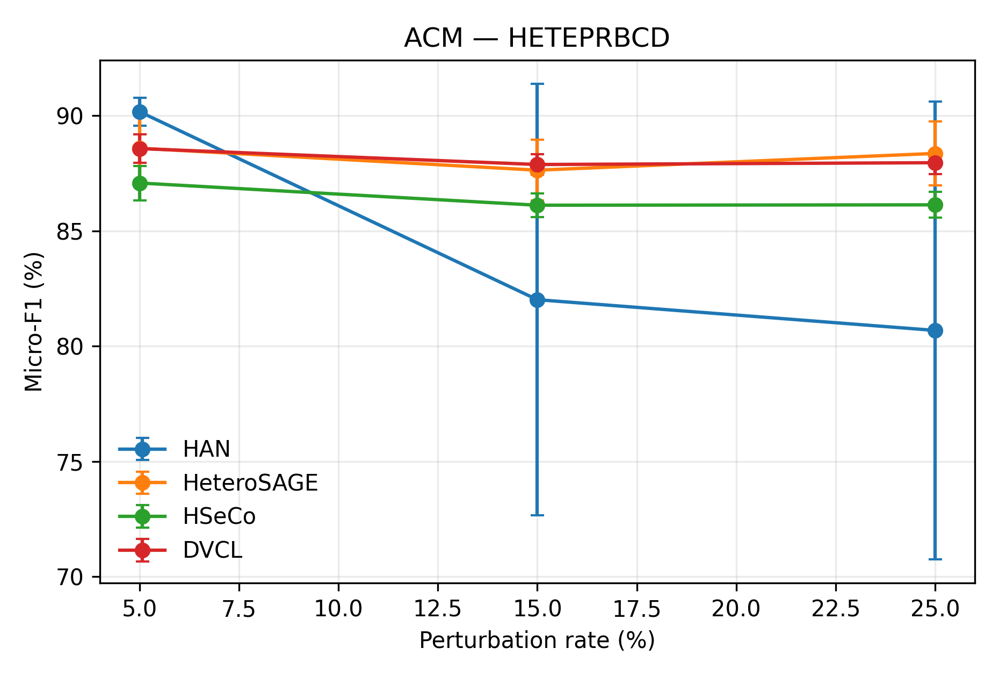
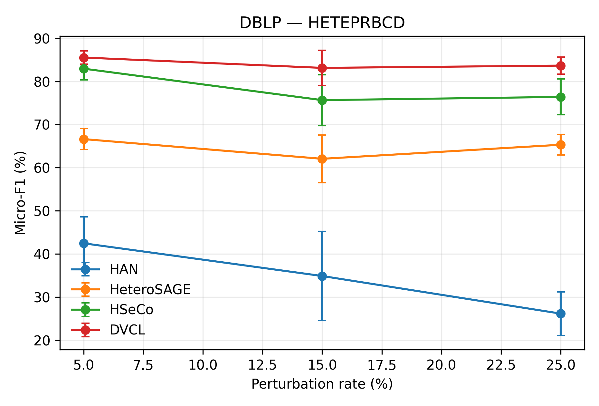
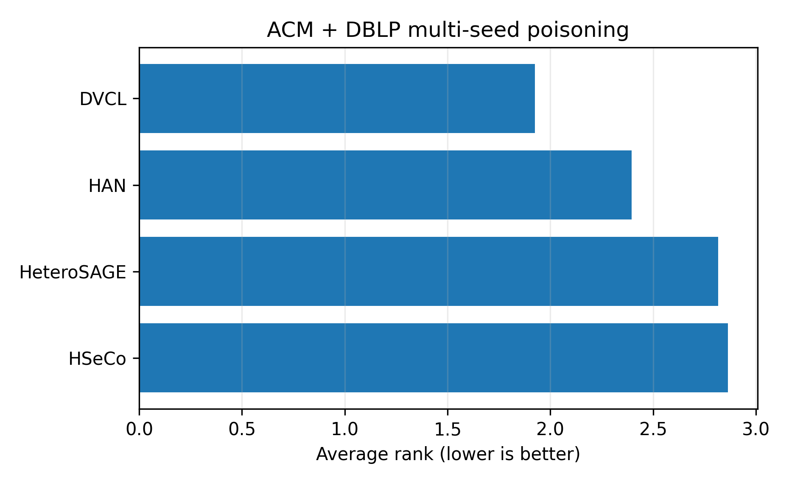
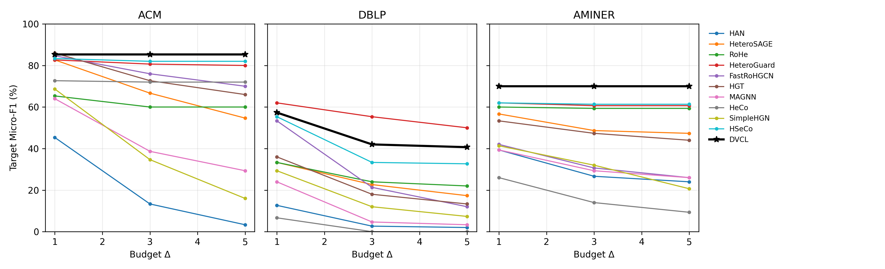
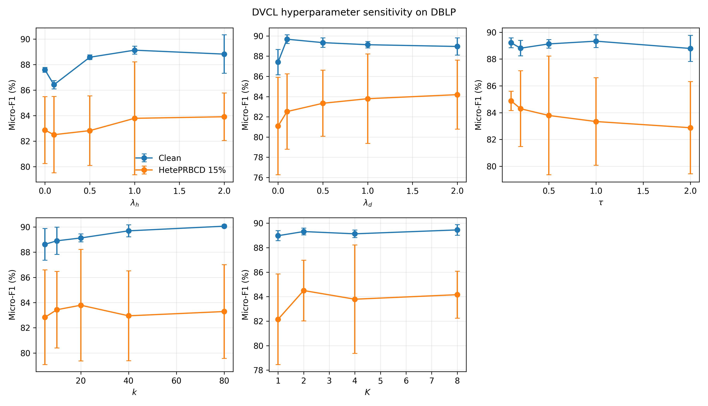

# 最终实验结果与统计分析

> **唯一论文结果主入口。** 主表统一使用三数据集、十一模型和 Micro-F1；覆盖范围不同的统计复验、自适应攻击与消融实验均独立成节，不与主表混合。

## 1. 实验设置与覆盖范围

| 实验族 | 数据集 | 模型范围 | 种子 | 用途 |
|---|---|---|---|---|
| 全局 poisoning 主实验 | ACM、DBLP、AMiner | 统一 11 模型 | $s_{atk}=1,s_{train}=1\ldots5$ | PRBCD、HetePRBCD、RND 主比较 |
| HG 迁移目标逃逸 | ACM、DBLP、AMiner | 统一 11 模型 | artifact seed 1，$s_{train}=1\ldots5$ | 测试时固定攻击迁移性 |
| 多攻击种子统计复验 | ACM、DBLP | HAN、HeteroSAGE、HSeCo、DVCL | $s_{atk}=1\ldots3,s_{train}=1\ldots5$ | 显著性与攻击种子稳定性 |
| 模型自适应目标逃逸 | ACM、DBLP、AMiner | 统一 11 模型 | $(s_a,s_t)=(1,1),(2,2),(3,3)$ | 每模型独立优化攻击边 |
| 组件消融 | ACM、DBLP | DVCL 四个 variant | $s_{train}=1\ldots5$ | 模块贡献 |
| 拓扑实现版本审计 | DBLP | DVCL 两个 topology variant | $(s_a,s_t)=(1,1),(2,2),(3,3)$ | 冻结论文方法版本 |
| 超参数敏感性 | DBLP | DVCL 最终版本 | $(s_a,s_t)=(1,1),(2,2),(3,3)$ | 单因素局部稳定性 |
| 效率与资源 | ACM、DBLP、AMiner | 统一 11 模型 | $s_{train}=1,2,3$ | 参数量、时间、延迟、显存与查询成本 |

统一训练设置为 $E_{max}=200$、$P=100$ 和完整模型 checkpoint。Poisoning 扰动率为 $r\in\{5,10,15,20,25\}\%$；目标逃逸预算为 $\Delta\in\{1,3,5\}$。表格报告均值 ± 样本标准差。

完整性检查覆盖 18 套协议、4501/4501 次运行，所有主表单元及方法版本审计均通过覆盖与输入哈希校验。

## 2. 三数据集统一十一模型全局 Poisoning

三张主表使用完全相同的 11 个模型和列顺序。PRBCD/HetePRBCD 展示 5%、15%、25% 代表点，RND Avg. 聚合 5%–25%；10%、20% 明细保留在数据集附录。

### ACM

| Model | Clean | PRBCD 5% | PRBCD 15% | PRBCD 25% | HetePRBCD 5% | HetePRBCD 15% | HetePRBCD 25% | RND Avg. |
|---|---:|---:|---:|---:|---:|---:|---:|---:|
| HAN | 91.16 ± 0.28 | 90.25 ± 0.65 | 87.77 ± 1.21 | 87.27 ± 0.71 | 90.21 ± 1.04 | 84.22 ± 8.64 | 83.30 ± 8.90 | 89.70 ± 0.08 |
| HeteroSAGE | 88.95 ± 2.64 | 87.50 ± 2.73 | 86.13 ± 3.06 | 87.25 ± 1.32 | 88.51 ± 2.06 | 87.14 ± 1.67 | 87.76 ± 1.80 | 88.35 ± 1.03 |
| RoHe | 85.59 ± 0.55 | 85.65 ± 0.54 | 86.01 ± 0.34 | 85.77 ± 0.34 | 85.81 ± 0.43 | 85.28 ± 0.75 | 85.26 ± 1.04 | 85.53 ± 0.64 |
| HeteroGuard | 86.57 ± 0.27 | 86.30 ± 0.42 | 86.08 ± 0.45 | 85.75 ± 0.63 | 87.05 ± 0.14 | 86.70 ± 0.21 | 86.19 ± 0.47 | 86.40 ± 0.21 |
| FastRoHGCN | 89.77 ± 0.29 | 87.92 ± 0.93 | 85.25 ± 2.01 | 82.63 ± 2.52 | 88.24 ± 2.51 | 88.17 ± 1.52 | 88.17 ± 0.51 | 89.46 ± 0.11 |
| HGT | 88.21 ± 0.67 | 87.85 ± 0.34 | 87.05 ± 0.59 | 86.71 ± 0.50 | 87.47 ± 0.41 | 87.44 ± 0.59 | 87.86 ± 0.44 | 87.56 ± 0.49 |
| MAGNN | 89.61 ± 0.74 | 87.28 ± 1.05 | 86.36 ± 0.95 | 85.37 ± 0.84 | 87.58 ± 0.48 | 83.95 ± 0.60 | 83.26 ± 0.79 | 88.33 ± 0.24 |
| HeCo | 75.48 ± 0.29 | 75.04 ± 0.45 | 74.98 ± 0.62 | 74.94 ± 0.66 | 75.29 ± 0.28 | 75.08 ± 0.57 | 75.25 ± 0.45 | 73.25 ± 0.37 |
| SimpleHGN | 90.48 ± 0.98 | 87.84 ± 0.46 | 82.39 ± 0.97 | 80.46 ± 1.90 | 88.68 ± 1.12 | 81.92 ± 1.23 | 78.98 ± 1.43 | 89.38 ± 0.53 |
| HSeCo | 87.63 ± 0.49 | 86.07 ± 0.70 | 85.81 ± 0.39 | 86.03 ± 0.67 | 87.49 ± 0.82 | 86.01 ± 0.49 | 86.02 ± 0.39 | 87.14 ± 0.44 |
| DVCL | 88.63 ± 0.66 | 88.11 ± 0.36 | 88.05 ± 0.42 | 88.00 ± 0.56 | 88.56 ± 0.59 | 87.70 ± 0.58 | 87.91 ± 0.51 | 88.77 ± 0.43 |

### DBLP

| Model | Clean | PRBCD 5% | PRBCD 15% | PRBCD 25% | HetePRBCD 5% | HetePRBCD 15% | HetePRBCD 25% | RND Avg. |
|---|---:|---:|---:|---:|---:|---:|---:|---:|
| HAN | 92.84 ± 0.31 | 92.93 ± 0.40 | 91.36 ± 0.55 | 74.67 ± 1.01 | 35.75 ± 4.20 | 32.36 ± 3.32 | 28.93 ± 8.53 | 79.61 ± 1.41 |
| HeteroSAGE | 80.49 ± 0.38 | 77.90 ± 0.38 | 77.12 ± 0.53 | 77.97 ± 0.57 | 65.47 ± 1.59 | 56.52 ± 5.63 | 64.16 ± 2.39 | 77.98 ± 0.20 |
| RoHe | 79.53 ± 0.40 | 78.52 ± 0.44 | 78.33 ± 0.46 | 77.41 ± 1.40 | 78.15 ± 1.16 | 66.90 ± 3.05 | 63.55 ± 1.88 | 77.92 ± 0.24 |
| HeteroGuard | 79.17 ± 0.30 | 77.87 ± 0.50 | 78.36 ± 0.29 | 77.57 ± 0.50 | 75.76 ± 0.57 | 76.82 ± 0.31 | 75.40 ± 1.20 | 78.78 ± 0.15 |
| FastRoHGCN | 90.15 ± 0.47 | 49.01 ± 2.42 | 51.16 ± 2.85 | 52.03 ± 2.72 | 48.66 ± 5.30 | 35.88 ± 2.56 | 39.98 ± 7.19 | 86.72 ± 0.77 |
| HGT | 76.01 ± 2.12 | 67.41 ± 1.78 | 65.95 ± 2.05 | 65.64 ± 2.50 | 61.34 ± 2.75 | 48.84 ± 4.04 | 44.33 ± 1.85 | 72.42 ± 1.38 |
| MAGNN | 90.05 ± 0.13 | 88.11 ± 0.71 | 85.32 ± 1.10 | 80.96 ± 0.62 | 32.26 ± 3.09 | 26.41 ± 3.63 | 25.60 ± 4.01 | 79.69 ± 0.29 |
| HeCo | 79.05 ± 2.66 | 68.70 ± 4.92 | 59.83 ± 4.00 | 56.61 ± 2.88 | 31.32 ± 3.43 | 32.25 ± 6.67 | 27.08 ± 5.02 | 65.20 ± 3.02 |
| SimpleHGN | 92.71 ± 0.46 | 85.88 ± 2.08 | 83.79 ± 1.85 | 83.41 ± 0.87 | 36.33 ± 2.83 | 23.86 ± 3.98 | 23.61 ± 3.99 | 84.61 ± 0.62 |
| HSeCo | 89.14 ± 0.50 | 90.02 ± 0.98 | 87.37 ± 1.46 | 85.74 ± 1.22 | 83.25 ± 2.32 | 68.89 ± 4.35 | 76.46 ± 0.90 | 85.75 ± 0.49 |
| DVCL | 89.55 ± 0.64 | 88.13 ± 0.70 | 86.78 ± 1.09 | 86.35 ± 0.65 | 86.10 ± 1.06 | 77.81 ± 0.86 | 82.21 ± 1.34 | 86.21 ± 0.56 |

### AMINER

| Model | Clean | PRBCD 5% | PRBCD 15% | PRBCD 25% | HetePRBCD 5% | HetePRBCD 15% | HetePRBCD 25% | RND Avg. |
|---|---:|---:|---:|---:|---:|---:|---:|---:|
| HAN | 85.49 ± 0.03 | 84.96 ± 0.34 | 85.08 ± 0.27 | 84.83 ± 0.22 | 85.10 ± 0.18 | 85.14 ± 0.12 | 85.11 ± 0.42 | 83.87 ± 0.08 |
| HeteroSAGE | 85.02 ± 0.17 | 85.24 ± 0.13 | 85.11 ± 0.11 | 84.82 ± 0.07 | 85.02 ± 0.15 | 85.01 ± 0.07 | 85.04 ± 0.11 | 84.10 ± 0.12 |
| RoHe | 86.64 ± 0.40 | 86.85 ± 0.21 | 86.56 ± 0.48 | 86.81 ± 0.24 | 86.29 ± 0.18 | 86.74 ± 0.29 | 86.73 ± 0.22 | 86.25 ± 0.25 |
| HeteroGuard | 85.55 ± 0.18 | 85.50 ± 0.18 | 85.51 ± 0.22 | 85.49 ± 0.24 | 84.37 ± 1.02 | 85.24 ± 0.46 | 85.73 ± 0.33 | 85.55 ± 0.23 |
| FastRoHGCN | 83.74 ± 1.51 | 80.53 ± 1.52 | 77.49 ± 1.13 | 75.63 ± 1.57 | 83.51 ± 0.98 | 83.35 ± 1.68 | 83.70 ± 0.63 | 83.51 ± 0.27 |
| HGT | 82.91 ± 0.45 | 82.70 ± 0.29 | 82.99 ± 0.43 | 82.92 ± 0.38 | 82.47 ± 0.47 | 81.91 ± 0.67 | 81.71 ± 0.65 | 82.86 ± 0.21 |
| MAGNN | 84.92 ± 0.40 | 84.13 ± 0.53 | 83.74 ± 0.50 | 83.49 ± 0.45 | 83.05 ± 0.65 | 80.93 ± 0.27 | 79.23 ± 1.10 | 82.14 ± 0.49 |
| HeCo | 63.45 ± 2.51 | 63.55 ± 2.69 | 64.61 ± 2.76 | 63.16 ± 4.97 | 60.53 ± 1.34 | 64.66 ± 1.77 | 64.48 ± 3.44 | 60.42 ± 1.68 |
| SimpleHGN | 85.02 ± 0.62 | 84.17 ± 0.43 | 83.87 ± 0.46 | 83.44 ± 0.27 | 84.03 ± 0.50 | 81.62 ± 0.85 | 79.34 ± 1.79 | 83.73 ± 0.69 |
| HSeCo | 85.61 ± 0.46 | 85.73 ± 0.50 | 85.79 ± 0.18 | 85.66 ± 0.41 | 85.45 ± 0.11 | 85.21 ± 0.30 | 85.32 ± 0.13 | 85.42 ± 0.24 |
| DVCL | 87.70 ± 0.12 | 87.83 ± 0.08 | 87.80 ± 0.13 | 87.78 ± 0.10 | 87.59 ± 0.12 | 87.53 ± 0.12 | 87.48 ± 0.22 | 87.77 ± 0.04 |

**关系口径：** ACM/DBLP 的三类 poisoning artifact 均围绕 P–A 关系生成；AMiner 的 PRBCD/HetePRBCD 修改 P–A，RND 同时修改 P–A 与 P–R。三数据集结果可以比较模型表现，但不能把不同关系上的同一扰动率解释为完全相同的结构难度。

## 3. ACM/DBLP 多攻击种子统计复验

本节不是另一张主基线表，只复验四个核心模型。AMiner 当前只有一个正式 attack seed，因此不进入多攻击种子显著性检验。每个攻击平均单元聚合 3 个攻击种子×5 个训练种子。括号为相对 clean 的下降百分点。

| Dataset | Condition | HAN | HeteroSAGE | HSeCo | DVCL |
|---|---|---:|---:|---:|---:|
| ACM | Clean | 91.16 ± 0.28 | 88.95 ± 2.64 | 87.63 ± 0.49 | 88.63 ± 0.66 |
| ACM | PRBCD Avg. | 88.50 ± 0.50 (+2.66) | 87.19 ± 2.14 (+1.77) | 85.82 ± 0.41 (+1.81) | 88.04 ± 0.41 (+0.60) |
| ACM | HetePRBCD Avg. | 84.29 ± 6.53 (+6.87) | 88.19 ± 1.06 (+0.76) | 86.44 ± 0.47 (+1.19) | 88.13 ± 0.33 (+0.50) |
| ACM | Attack Avg. | 86.39 ± 3.34 (+4.77) | 87.69 ± 1.50 (+1.26) | 86.13 ± 0.41 (+1.50) | 88.08 ± 0.35 (+0.55) |
| DBLP | Clean | 92.84 ± 0.31 | 80.49 ± 0.38 | 89.14 ± 0.50 | 89.55 ± 0.64 |
| DBLP | PRBCD Avg. | 89.41 ± 2.69 (+3.42) | 77.44 ± 0.36 (+3.04) | 89.08 ± 1.39 (+0.06) | 87.68 ± 0.85 (+1.87) |
| DBLP | HetePRBCD Avg. | 34.52 ± 4.99 (+58.32) | 64.67 ± 3.00 (+15.82) | 78.33 ± 2.86 (+10.81) | 84.10 ± 1.89 (+5.45) |
| DBLP | Attack Avg. | 61.96 ± 3.37 (+30.87) | 71.05 ± 1.50 (+9.43) | 83.71 ± 1.98 (+5.43) | 85.89 ± 1.30 (+3.66) |

正效应表示 DVCL 更高；W/T/L 为 15 个配对的胜/平/负次数。

| Dataset | Baseline | $n$ | Effect (pp) | W/T/L | $p_{Holm}$ |
|---|---|---:|---:|---:|---:|
| ACM | HAN | 15 | +1.69 | 6/0/9 | 1 |
| ACM | HeteroSAGE | 15 | +0.40 | 9/0/6 | 1 |
| ACM | HSeCo | 15 | +1.96 | 15/0/0 | 0.0011 |
| DBLP | HAN | 15 | +23.93 | 15/0/0 | 0.0011 |
| DBLP | HeteroSAGE | 15 | +14.84 | 15/0/0 | 0.0011 |
| DBLP | HSeCo | 15 | +2.18 | 15/0/0 | 0.0011 |

| Scope | HAN | HeteroSAGE | HSeCo | DVCL |
|---|---:|---:|---:|---:|
| ACM | 2.03 | 2.20 | 3.76 | 2.01 |
| DBLP | 2.76 | 3.43 | 1.97 | 1.84 |
| ALL | 2.39 | 2.82 | 2.86 | 1.93 |

## 4. 目标逃逸攻击

### 4.1 HG Baseline：统一十一模型迁移攻击

所有模型都在 clean 图训练，测试时应用同一批固定、非自适应目标 artifact。三数据集均使用相同模型集合和 $\Delta=1,3,5$。

#### ACM

| Model | Clean target | $\Delta=1$ | $\Delta=3$ | $\Delta=5$ | Drop@5 |
|---|---:|---:|---:|---:|---:|
| HAN | 89.28 ± 0.54 | 37.40 ± 10.20 | 22.28 ± 10.21 | 16.96 ± 8.42 | +72.32 |
| HeteroSAGE | 88.44 ± 2.50 | 84.84 ± 3.18 | 78.96 ± 2.56 | 72.88 ± 2.85 | +15.56 |
| RoHe | 85.00 ± 0.49 | 85.92 ± 0.33 | 86.04 ± 0.59 | 86.04 ± 0.48 | -1.04 |
| HeteroGuard | 86.32 ± 0.76 | 86.28 ± 1.00 | 86.04 ± 1.15 | 85.32 ± 1.11 | +1.00 |
| FastRoHGCN | 89.36 ± 0.38 | 85.64 ± 0.82 | 70.76 ± 1.07 | 54.08 ± 1.91 | +35.56 |
| HGT | 89.00 ± 0.45 | 88.16 ± 1.01 | 87.68 ± 0.88 | 86.24 ± 0.95 | +2.76 |
| MAGNN | 89.80 ± 0.68 | 59.00 ± 5.57 | 42.48 ± 4.11 | 36.92 ± 2.82 | +52.88 |
| HeCo | 74.84 ± 0.26 | 74.80 ± 0.24 | 74.72 ± 0.73 | 74.36 ± 0.93 | +0.44 |
| SimpleHGN | 91.08 ± 0.39 | 78.52 ± 11.83 | 52.92 ± 11.19 | 30.92 ± 10.27 | +60.16 |
| HSeCo | 87.04 ± 0.92 | 86.84 ± 0.70 | 86.72 ± 0.64 | 86.56 ± 0.59 | +0.48 |
| DVCL | 88.16 ± 0.85 | 88.12 ± 0.64 | 88.24 ± 0.70 | 88.16 ± 0.71 | +0.00 |

#### DBLP

| Model | Clean target | $\Delta=1$ | $\Delta=3$ | $\Delta=5$ | Drop@5 |
|---|---:|---:|---:|---:|---:|
| HAN | 94.14 ± 0.48 | 10.75 ± 3.04 | 5.43 ± 0.12 | 5.11 ± 0.27 | +89.03 |
| HeteroSAGE | 80.22 ± 0.73 | 48.23 ± 2.07 | 37.74 ± 1.12 | 32.85 ± 1.38 | +47.37 |
| RoHe | 78.92 ± 0.41 | 75.32 ± 0.82 | 55.70 ± 2.47 | 48.06 ± 2.47 | +30.86 |
| HeteroGuard | 77.15 ± 0.85 | 76.08 ± 0.63 | 72.20 ± 1.07 | 67.85 ± 1.42 | +9.30 |
| FastRoHGCN | 90.32 ± 1.09 | 70.75 ± 1.32 | 39.46 ± 2.91 | 20.81 ± 2.03 | +69.52 |
| HGT | 74.46 ± 2.90 | 69.68 ± 2.76 | 67.58 ± 5.84 | 66.94 ± 5.59 | +7.53 |
| MAGNN | 91.77 ± 1.21 | 64.25 ± 3.78 | 44.95 ± 1.55 | 34.95 ± 2.06 | +56.83 |
| HeCo | 78.39 ± 3.66 | 27.42 ± 5.11 | 13.12 ± 6.23 | 13.55 ± 12.98 | +63.23 |
| SimpleHGN | 93.49 ± 1.34 | 76.18 ± 2.81 | 43.71 ± 4.50 | 28.12 ± 5.21 | +65.38 |
| HSeCo | 90.16 ± 1.03 | 81.08 ± 0.45 | 69.73 ± 1.43 | 64.35 ± 0.90 | +25.81 |
| DVCL | 89.30 ± 0.99 | 83.60 ± 0.91 | 74.84 ± 0.82 | 70.91 ± 1.05 | +18.39 |

#### AMINER

| Model | Clean target | $\Delta=1$ | $\Delta=3$ | $\Delta=5$ | Drop@5 |
|---|---:|---:|---:|---:|---:|
| HAN | 87.91 ± 0.13 | 43.74 ± 0.87 | 29.26 ± 1.35 | 25.04 ± 1.67 | +62.88 |
| HeteroSAGE | 86.91 ± 0.63 | 83.88 ± 0.55 | 79.90 ± 0.36 | 78.90 ± 0.80 | +8.01 |
| RoHe | 87.48 ± 0.36 | 87.48 ± 0.46 | 87.53 ± 0.45 | 87.43 ± 0.50 | +0.05 |
| HeteroGuard | 86.86 ± 0.57 | 86.86 ± 0.57 | 86.95 ± 0.63 | 86.95 ± 0.63 | -0.10 |
| FastRoHGCN | 85.80 ± 1.26 | 52.66 ± 10.25 | 40.00 ± 0.57 | 37.22 ± 1.06 | +48.59 |
| HGT | 84.70 ± 1.16 | 84.46 ± 1.47 | 83.17 ± 1.26 | 83.02 ± 1.22 | +1.68 |
| MAGNN | 86.62 ± 1.17 | 46.09 ± 2.36 | 28.35 ± 2.75 | 21.01 ± 1.68 | +65.61 |
| HeCo | 60.91 ± 3.80 | 41.68 ± 6.78 | 34.10 ± 11.75 | 23.93 ± 8.15 | +36.31 |
| SimpleHGN | 86.91 ± 0.75 | 69.16 ± 4.88 | 55.78 ± 6.65 | 47.67 ± 4.76 | +39.23 |
| HSeCo | 87.39 ± 0.53 | 87.39 ± 0.53 | 87.39 ± 0.53 | 87.19 ± 0.47 | +0.19 |
| DVCL | 89.40 ± 0.69 | 89.40 ± 0.69 | 89.45 ± 0.70 | 89.45 ± 0.70 | -0.05 |

固定 HG artifact 不针对每个被评估模型优化，因此个别负下降表示少量错误预测被扰动纠正，不能解释为自适应鲁棒性。

### 4.2 统一十一模型自适应攻击

每个模型与 checkpoint 独立执行 score-based 贪心查询；相同数据集和 seed 共享候选池，但最终攻击边由 victim 模型决定。每目标候选池为 64 条增边和 64 条删边，$\Delta\in\{1,3,5\}$ 为最大预算。正式矩阵包含 99 次物理搜索和 297 个预算评估；权威审计为 `outputs/analysis/adaptive_target_evasion_v1/audit.json`。

#### ACM

| Model | Clean target | $\Delta=1$ | $\Delta=3$ | $\Delta=5$ | Drop@5 |
|---|---:|---:|---:|---:|---:|
| HAN | 86.67 ± 1.15 | 45.33 ± 7.02 | 13.33 ± 3.06 | 3.33 ± 1.15 | +83.33 |
| HeteroSAGE | 88.00 ± 4.00 | 82.67 ± 3.06 | 66.67 ± 5.03 | 54.67 ± 8.08 | +33.33 |
| RoHe | 86.00 ± 0.00 | 65.33 ± 8.33 | 60.00 ± 10.58 | 60.00 ± 10.58 | +26.00 |
| HeteroGuard | 84.00 ± 0.00 | 82.67 ± 2.31 | 80.67 ± 3.06 | 80.00 ± 3.46 | +4.00 |
| FastRoHGCN | 92.67 ± 1.15 | 84.67 ± 1.15 | 76.00 ± 4.00 | 70.00 ± 2.00 | +22.67 |
| HGT | 89.33 ± 3.06 | 86.00 ± 3.46 | 72.67 ± 1.15 | 66.00 ± 2.00 | +23.33 |
| MAGNN | 90.00 ± 4.00 | 64.00 ± 2.00 | 38.67 ± 9.87 | 29.33 ± 7.57 | +60.67 |
| HeCo | 73.33 ± 2.31 | 72.67 ± 1.15 | 72.00 ± 0.00 | 72.00 ± 0.00 | +1.33 |
| SimpleHGN | 92.67 ± 3.06 | 68.67 ± 14.47 | 34.67 ± 14.05 | 16.00 ± 6.93 | +76.67 |
| HSeCo | 84.00 ± 3.46 | 83.33 ± 3.06 | 82.00 ± 2.00 | 82.00 ± 2.00 | +2.00 |
| DVCL | 85.33 ± 1.15 | 85.33 ± 1.15 | 85.33 ± 1.15 | 85.33 ± 1.15 | +0.00 |

#### DBLP

| Model | Clean target | $\Delta=1$ | $\Delta=3$ | $\Delta=5$ | Drop@5 |
|---|---:|---:|---:|---:|---:|
| HAN | 97.33 ± 1.15 | 12.67 ± 3.06 | 2.67 ± 1.15 | 2.00 ± 0.00 | +95.33 |
| HeteroSAGE | 76.67 ± 2.31 | 33.33 ± 5.03 | 22.67 ± 1.15 | 17.33 ± 1.15 | +59.33 |
| RoHe | 68.67 ± 2.31 | 33.33 ± 4.16 | 24.00 ± 2.00 | 22.00 ± 0.00 | +46.67 |
| HeteroGuard | 71.33 ± 5.03 | 62.00 ± 2.00 | 55.33 ± 1.15 | 50.00 ± 4.00 | +21.33 |
| FastRoHGCN | 94.00 ± 2.00 | 53.33 ± 8.33 | 21.33 ± 1.15 | 12.00 ± 0.00 | +82.00 |
| HGT | 72.67 ± 9.87 | 36.00 ± 4.00 | 18.00 ± 2.00 | 13.33 ± 1.15 | +59.33 |
| MAGNN | 94.00 ± 2.00 | 24.00 ± 10.58 | 4.67 ± 2.31 | 3.33 ± 2.31 | +90.67 |
| HeCo | 72.00 ± 5.29 | 6.67 ± 3.06 | 0.00 ± 0.00 | 0.00 ± 0.00 | +72.00 |
| SimpleHGN | 94.67 ± 4.16 | 29.33 ± 7.57 | 12.00 ± 5.29 | 7.33 ± 1.15 | +87.33 |
| HSeCo | 92.00 ± 0.00 | 55.33 ± 2.31 | 33.33 ± 5.03 | 32.67 ± 5.03 | +59.33 |
| DVCL | 86.67 ± 1.15 | 57.33 ± 3.06 | 42.00 ± 2.00 | 40.67 ± 2.31 | +46.00 |

#### AMINER

| Model | Clean target | $\Delta=1$ | $\Delta=3$ | $\Delta=5$ | Drop@5 |
|---|---:|---:|---:|---:|---:|
| HAN | 66.00 ± 2.00 | 39.33 ± 3.06 | 26.67 ± 1.15 | 24.00 ± 0.00 | +42.00 |
| HeteroSAGE | 61.33 ± 1.15 | 56.67 ± 2.31 | 48.67 ± 1.15 | 47.33 ± 2.31 | +14.00 |
| RoHe | 66.00 ± 2.00 | 60.00 ± 3.46 | 59.33 ± 3.06 | 59.33 ± 3.06 | +6.67 |
| HeteroGuard | 63.33 ± 3.06 | 62.00 ± 2.00 | 60.67 ± 1.15 | 60.67 ± 1.15 | +2.67 |
| FastRoHGCN | 66.00 ± 2.00 | 42.00 ± 5.29 | 30.67 ± 6.11 | 26.00 ± 3.46 | +40.00 |
| HGT | 60.00 ± 3.46 | 53.33 ± 5.03 | 47.33 ± 3.06 | 44.00 ± 2.00 | +16.00 |
| MAGNN | 66.00 ± 3.46 | 39.33 ± 1.15 | 29.33 ± 5.03 | 26.00 ± 2.00 | +40.00 |
| HeCo | 34.00 ± 4.00 | 26.00 ± 3.46 | 14.00 ± 9.17 | 9.33 ± 6.11 | +24.67 |
| SimpleHGN | 64.67 ± 1.15 | 41.33 ± 7.02 | 32.00 ± 3.46 | 20.67 ± 5.03 | +44.00 |
| HSeCo | 63.33 ± 2.31 | 62.00 ± 3.46 | 61.33 ± 4.16 | 61.33 ± 4.16 | +2.00 |
| DVCL | 70.00 ± 3.46 | 70.00 ± 3.46 | 70.00 ± 3.46 | 70.00 ± 3.46 | +0.00 |

**攻击有效性诊断（跨 11 模型均值）**

| Dataset | $\Delta$ | ASR | Budget utilization | Changes | Queries |
|---|---:|---:|---:|---:|---:|
| ACM | 1 | 13.47% | 75.09% | 37.5 | 2922.5 |
| ACM | 3 | 27.54% | 61.39% | 92.1 | 6744.2 |
| ACM | 5 | 33.95% | 52.24% | 130.6 | 9394.0 |
| DBLP | 1 | 55.29% | 80.67% | 40.3 | 2883.8 |
| DBLP | 3 | 73.19% | 43.52% | 65.3 | 4789.7 |
| DBLP | 5 | 77.10% | 31.20% | 78.0 | 5742.3 |
| AMINER | 1 | 18.90% | 54.97% | 27.5 | 2284.8 |
| AMINER | 3 | 30.41% | 42.38% | 63.6 | 5164.7 |
| AMINER | 5 | 35.49% | 36.30% | 90.8 | 7245.8 |

**平均排名与最近竞争基线**

| Dataset | Best model | Best rank | DVCL rank |
|---|---|---:|---:|
| ACM | DVCL | 1.44 | 1.44 |
| DBLP | HeteroGuard | 1.06 | 2.22 |
| AMINER | DVCL | 1.00 | 1.00 |

正效应表示 DVCL 的三预算平均攻击后 Micro-F1 更高；95% CI 为三个配对重复的均值 t 区间。

| Dataset | Baseline | $n$ | Effect (pp) [95% CI] | W/T/L | $p_{Holm}$ |
|---|---|---:|---:|---:|---:|
| ACM | HSeCo | 3 | +2.89 [-0.56, +6.34] | 3/0/0 | 1 |
| DBLP | HeteroGuard | 3 | -9.11 [-10.07, -8.15] | 0/0/3 | 1 |
| AMINER | HeteroGuard | 3 | +8.89 [+2.62, +15.16] | 3/0/0 | 1 |

ACM 和 AMiner 中 DVCL 在当前 64+64 有限候选攻击下未出现目标 Micro-F1 下降，但这只能说明该查询攻击未找到成功扰动，不能证明完整候选空间或白盒攻击下的鲁棒性。DBLP 中 DVCL 在 $\Delta=5$ 下降 46.00 个百分点，且平均排名低于 HeteroGuard，确认 DVCL 存在数据集依赖的自适应目标逃逸脆弱性。每数据集只有 3 个独立配对重复，Holm 校正后均未达到显著，效应量和置信区间应与排名共同解释。

## 5. ACM/DBLP 组件消融

消融只回答 DVCL 组件贡献，不作为三数据集基线比较。

### ACM

| Variant | Clean | PRBCD Avg. | HetePRBCD Avg. | Attack Avg. |
|---|---:|---:|---:|---:|
| Full DVCL | 88.63 ± 0.66 | 88.05 ± 0.42 | 88.06 ± 0.36 | 88.05 ± 0.39 |
| w/o Cross-view CL | 88.12 ± 0.53 | 87.31 ± 0.64 | 87.54 ± 0.74 | 87.42 ± 0.68 |
| w/o Feature View | 87.59 ± 0.50 | 85.84 ± 0.23 | 86.21 ± 0.22 | 86.03 ± 0.17 |
| w/o Topology View | 86.47 ± 0.76 | 86.47 ± 0.76 | 86.47 ± 0.76 | 86.47 ± 0.76 |

### DBLP

| Variant | Clean | PRBCD Avg. | HetePRBCD Avg. | Attack Avg. |
|---|---:|---:|---:|---:|
| Full DVCL | 89.55 ± 0.64 | 87.09 ± 0.77 | 82.04 ± 0.76 | 84.56 ± 0.74 |
| w/o Cross-view CL | 88.02 ± 1.53 | 86.20 ± 0.62 | 80.07 ± 1.16 | 83.14 ± 0.76 |
| w/o Feature View | 89.26 ± 0.58 | 86.88 ± 1.18 | 71.16 ± 1.92 | 79.02 ± 1.54 |
| w/o Topology View | 79.79 ± 0.47 | 79.79 ± 0.47 | 79.79 ± 0.47 | 79.79 ± 0.47 |

### 拓扑实现版本审计

两个版本均使用 $\lambda_h=1$，仅比较第二级语义硬过滤是否保留。正式审计包含 clean、HetePRBCD 25% 和针对各自 checkpoint 独立优化的目标逃逸攻击。

| Variant | Clean | HetePRBCD 25% | Adaptive $\Delta=1$ | Adaptive $\Delta=3$ | Adaptive $\Delta=5$ |
|---|---:|---:|---:|---:|---:|
| Graph + hard filter + $L_{HAN}$ | 89.13 ± 0.31 | 83.75 ± 2.37 | 57.33 ± 3.06 | 42.00 ± 2.00 | 40.67 ± 2.31 |
| Graph + no second filter + $L_{HAN}$ | 88.60 ± 0.26 | 82.08 ± 1.19 | 61.33 ± 3.06 | 43.33 ± 1.15 | 33.33 ± 3.06 |

`graph_no_filter` 相对 `graph_hard` 在 $\Delta=1,3,5$ 下的攻击后 Micro-F1 差异依次为 +4.00、+1.33、-7.33 pp，且最大配对 HetePRBCD 损失为 3.82 pp，未通过预注册门槛。因此论文方法版本冻结为 `graph_hard`；`han_semantic` 不进入同架构敏感性实验。

### DVCL 超参数敏感性

最终 `concat + graph_hard` 在 DBLP clean 与 HetePRBCD 15% 上执行单因素实验。表中范围覆盖全部预注册取值；参照组合为 $(\lambda_h,\lambda_d,\tau,k,K)=(1,1,0.5,20,4)$。

| 参数 | Clean 范围 | HetePRBCD 15% 范围 | 最大局部损失 | 与最佳观测最大差距 | 局部稳定 |
|---|---:|---:|---:|---:|:---:|
| $\lambda_h$ | 86.42–89.13 | 82.51–83.91 | 0.96 pp | 0.12 pp | 是 |
| $\lambda_d$ | 87.40–89.67 | 81.08–84.19 | 0.45 pp | 0.54 pp | 是 |
| $\tau$ | 88.79–89.33 | 82.88–84.88 | 0.45 pp | 1.09 pp | 是 |
| $k$ | 88.63–90.06 | 82.84–83.79 | 0.84 pp | 0.93 pp | 是 |
| $K$ | 88.97–89.45 | 82.15–84.50 | 0.00 pp | 0.71 pp | 是 |

五个参数均通过预注册的 2 pp 局部稳定门槛。该结论描述冻结参数邻域内的稳定性，不将本轮最佳观测值作为重新调参依据。

## 6. 效率与资源

全部测量在单张独占 Tesla V100 上串行完成。训练时间包含模型内部预处理、优化、早停、最佳模型恢复与测试；推理在静态预处理完成后预热 10 次并同步测量完整图前向 50 次。Micro-F1 是本轮三种子伴随结果，不替代五种子准确率主表。下表突出 HSeCo 与 DVCL，统一 11 模型明细见 `docs/model-efficiency-results.md`。

| Dataset | Model | Params (M) | Train (s) | s/iter | Inference (ms) | Peak GPU (MiB) | Micro-F1 |
|---|---|---:|---:|---:|---:|---:|---:|
| ACM | HSeCo | 3.974 | 14.27 ± 0.39 | 0.1245 ± 0.0005 | 2.689 ± 0.007 | 902.3 ± 0.6 | 87.59 ± 0.52 |
| ACM | DVCL | 3.974 | 9.32 ± 1.54 | 0.0702 ± 0.0011 | 4.566 ± 0.395 | 630.1 ± 0.2 | 88.40 ± 0.78 |
| DBLP | HSeCo | 0.935 | 28.82 ± 6.59 | 0.1658 ± 0.0046 | 2.707 ± 0.022 | 1140.6 ± 0.9 | 89.25 ± 0.27 |
| DBLP | DVCL | 0.935 | 14.62 ± 3.59 | 0.0851 ± 0.0084 | 4.103 ± 0.886 | 1155.2 ± 0.1 | 89.13 ± 0.31 |
| AMINER | HSeCo | 13.521 | 20.35 ± 0.18 | 0.1884 ± 0.0007 | 9.046 ± 0.360 | 2632.9 ± 0.0 | 85.53 ± 0.56 |
| AMINER | DVCL | 13.521 | 9.24 ± 0.97 | 0.0848 ± 0.0089 | 12.007 ± 0.974 | 1531.0 ± 0.0 | 87.68 ± 0.16 |

自适应攻击查询成本仅描述攻击侧计算量。$\Delta=5$ 时，每目标平均 victim-model 查询次数如下；查询更少不代表模型更鲁棒。

| Dataset | HSeCo | DVCL |
|---|---:|---:|
| ACM | 75.9 ± 18.0 | 82.1 ± 22.3 |
| DBLP | 99.5 ± 6.4 | 109.6 ± 4.3 |
| AMINER | 75.2 ± 2.9 | 84.9 ± 5.1 |

| $K$ | State parameters (M) | Relative to $K=4$ |
|---:|---:|---:|
| 1 | 0.673 | 0.72× |
| 2 | 0.760 | 0.81× |
| 4 | 0.935 | 1.00× |
| 8 | 1.284 | 1.37× |

DVCL 与 HSeCo 在三个数据集上的参数量逐项相同。DVCL 完整训练分别快 1.53×、1.97×、2.20×，但完整图推理延迟分别为 HSeCo 的 1.70×、1.52×、1.33×。因此证据支持“训练更快”，不支持“训练与推理全面更高效”。$K=8$ 的容量为 $K=4$ 的 1.37×，F3 多头曲线同时包含容量变化。

## 7. 异常结果审计与结论边界

### 7.1 AMiner Poisoning 强度

| Attack | Relations | Realized $r$ | Train change share | Surrogate drop (pp) | Formal median drop (pp) |
|---|---|---:|---:|---:|---:|
| PRBCD | ap,pa | 5.00–25.00% | 82.1–98.9% | 0.07–0.57 | +0.05 |
| HETEPRBCD | ap,pa | 5.00–25.00% | 59.7–83.0% | 1.09–3.09 | +0.27 |

AMiner 的预算与 artifact 验证均正确，但替代模型和正式模型下降偏弱；这属于当前攻击生成器效果不足，不是漏施加预算。因此 AMiner poisoning 只能支持弱攻击条件下的横向比较。

### 7.2 可支持与不可支持的结论

1. 三数据集主表可以比较统一 11 模型在相同数据集、相同 artifact 下的 Micro-F1。
2. 多攻击种子复验支持 DVCL 相对 HSeCo 的 ACM/DBLP 总体增益，但不支持 DVCL 在每个数据集、每种攻击上普遍最优。
3. DVCL 在 DBLP PRBCD 平均下低于 HSeCo；ACM 相对 HAN/HeteroSAGE 的多种子差异未达到校正后显著。
4. HG 固定迁移攻击、自适应查询攻击和 poisoning 具有不同语义，禁止合并计算总 Attack Average。
5. 统一 11 模型自适应矩阵及视图失效诊断已完成；可靠性门控候选未通过预注册门槛，因此论文模型冻结为 `concat`，并明确 DBLP 自适应目标逃逸脆弱性。
6. ACM/DBLP 消融均支持双视图和跨视图对比学习的正贡献；DBLP 中移除特征视图后 HetePRBCD 平均下降 10.88 pp，说明特征视图主要缓冲拓扑攻击。
7. 拓扑实现版本审计不支持取消第二级语义硬过滤；F3 超参数敏感性固定使用 `graph_hard`，避免继续混用历史拓扑实现。
8. F3 的五个预注册参数均通过 2 pp 局部稳定门槛；该结果只覆盖 DBLP clean 与 HetePRBCD 15%，不用于替换冻结参数或外推自适应鲁棒性。
9. F4 显示 DVCL 相对 HSeCo 训练更快但完整图推理更慢；效率结论必须按训练、推理和显存分别陈述，不能概括为全面更高效。

## 8. 论文图表

## 9. 专项附录

- 完整扰动率与数据集明细：`docs/acm-experiment-results.md`、`docs/dblp-experiment-results.md`、`docs/aminer-experiment-results.md`
- 目标逃逸逐模型结果：`docs/target-evasion-results.md`
- DBLP 消融配对贡献与严格审计：`docs/dblp-ablation-results.md`
- DVCL 拓扑实现版本审计：`docs/dvcl-topology-version-pilot.md`
- DVCL 超参数敏感性：`docs/dvcl-hyperparameter-sensitivity.md`
- 统一十一模型效率与资源：`docs/model-efficiency-results.md`
- 鲁棒/OpenHGNN/RND 基线：`docs/robust-baseline-results.md`、`docs/openhgnn-baseline-results.md`、`docs/rnd-attack-results.md`
- 文档导航与口径优先级：`docs/README.md`
- 当前有效后续实验计划：`docs/next-experiment-plan.md`
