# 技术交底书

**案件名称**：一种基于分层语义净化与特征诱导对齐的鲁棒异构图节点分类方法

**技术联系人**：
- 姓名：刘颖
- 电话：[待填写]
- 邮箱：[待填写]

**专利类型**：发明

---

## 注意事项

（1）交底书应使代理人能看懂，尤其是背景技术和详细技术方案，一定要写得全面、清楚、完整；

（2）技术的公开程度，应以本领域普通技术人员不需付出创造性劳动即可进行实施为准；

（3）在与代理人沟通时，对于代理人咨询的技术问题，应给予回答并认真讲解，并且按要求及时正确地补充相应技术材料。

## 一、介绍相关技术背景，描述与本发明技术最相近的现有技术，并说明该现有技术存在的缺点

### 1.1 现有技术

本次围绕“异构图节点分类、异构图对比学习、图结构攻击防御、元路径语义建模”进行公开资料检索。与本发明最接近的技术可归为以下三类。

#### （1）异构图多视图对比学习技术

公开专利 CN114020928B 提出在新闻、用户和主题构成的异构图上，依据元路径构造原始图及随机变换图，再通过两个图神经网络进行对比学习，用于虚假新闻识别。该方案说明异构图可通过多视图表征与对比目标学习节点表示，但其视图主要由随机变换获得，未针对结构攻击中被篡改边的可信度进行逐元路径净化，也未提供独立于受攻击拓扑的稳定参考视图。

**来源链接**：https://patents.google.com/patent/CN114020928B/en

公开专利 CN120544693A 在关联预测任务中利用异构图拓扑信息和语义信息构造多个视图，并结合图卷积与对比损失学习表示。该方案表明基于特征相似度构造语义图是可行的，但其公开文本面向特定关联预测场景，未给出“候选边置信度筛选、元路径语义聚合后的全局再筛选、再与结构无关视图对齐”的协同链路。

**来源链接**：https://patents.google.com/patent/CN120544693A/zh

#### （2）元路径采样或语义建模的异构图表示学习技术

公开专利 CN117999559A 使用元路径邻居采样生成正负样本，并利用对比学习训练图神经网络，用于异常检测。该方案重视元路径邻居在异构网络中的语义作用，但其重点是样本采样与无监督表示训练，不涉及在结构扰动条件下对候选连接进行两阶段可信度净化。

**来源链接**：https://patents.google.com/patent/CN117999559A/zh

公开专利 CN114611587A 将多种元路径嵌入视为不同视图，通过对比学习实现异构知识图谱表示对齐。该方案可用于说明多元路径视图对比学习已有基础，但未以结构鲁棒性为目标构造由原始节点属性诱导的参考连接视图。

**来源链接**：https://patents.google.com/patent/CN114611587A/zh

#### （3）对抗结构扰动下的异构图鲁棒学习技术

RoHe 文献针对异构图对抗攻击，采用注意力净化器压制由拓扑和特征异常造成的恶意邻居影响，表明异构图的邻居净化是已知研究方向。其公开技术重心是对观测图邻域进行注意力式净化；从公开论文内容看，未采用按元路径分别计算属性一致性、先局部筛选再基于语义权重作全局筛选的层次净化结构，也未把由原始特征直接诱导的 K 近邻图作为与受攻击拓扑相对独立的对照视图，并利用节点同一性实施对称跨视图对齐。

**来源链接**：https://ojs.aaai.org/index.php/AAAI/article/view/20357

#### （4）检索结论

已有技术分别公开了异构图对比学习、元路径建模、特征相似图和鲁棒邻居净化等单项思路。经上述公开资料比对，本发明的拟保护主线不是这些单项要素的并列，而是用于结构扰动场景的协同闭环：先以“元路径候选连接的属性一致性”完成局部净化，再以“跨元路径语义重要性”完成全局净化；同时从原始节点特征构造不依赖受攻击边的参考视图；最后通过同一节点的双向跨视图对齐，使两种视图共同参与节点分类。该组合应作为独立权利要求的重点，局部净化、特征诱导视图和对齐损失宜在从属权利要求中进一步限定。

### 1.2 现有技术存在的缺点

（1）随机删边、随机掩码等增强方式没有区分自然边与攻击注入边，可能保留恶意连接或误删关键语义连接。

（2）仅在单一受攻击拓扑上进行邻居注意力或结构净化时，净化结果仍受被扰动的邻域约束，缺少可用于相互校验的、由原始属性建立的稳定参照。

（3）只按单个元路径进行筛选，难以同时利用各元路径内部的属性一致性和各元路径之间的任务相关性；不同元路径的噪声会被直接混入统一邻接关系。

（4）常规多视图对比学习多以随机增强视图为正样本，未明确利用“同一节点在净化拓扑视图和特征诱导视图中应保持一致”的约束，因而难以针对结构扰动校正表示偏移。

## 二、针对上述缺点，说明本发明所要解决的技术问题

本发明要解决的技术问题是：在异构图节点分类中，当观测关系边被插入、删除或重连而产生结构扰动时，如何在不完全依赖受扰动邻域的前提下，保留具有真实语义关联的候选连接，抑制跨元路径传播的低可信连接，并使同一节点在净化拓扑表征和特征诱导表征之间保持一致，从而提升节点分类的稳定性和准确性。

为此，本发明构建两类来源不同但可对齐的视图：一类是经分层语义净化后的拓扑视图，另一类是由原始目标节点特征直接诱导的参考视图。前者利用结构但减少疑似扰动边的影响，后者不以观测边作为建图依据。随后，本发明以同一节点的跨视图表示为正样本、不同节点的跨视图表示为负样本，使用对称对比目标约束两个视图对同一节点给出一致表示。

## 三、本发明技术方案的详细阐述

### 3.1 背景

设待分类对象组成的异构图为 (G=(V,E,\mathcal{T},\mathcal{R},X)\)。其中，(V) 为节点集合，(E) 为观测关系边集合，\(\mathcal{T}\)<!-- 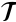 --> 为节点类型集合，\(\mathcal{R}\)<!-- 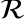 --> 为关系类型集合，(X) 为节点属性矩阵。目标节点属于预设目标类型，其余节点可作为元路径传播中的中间节点。

在结构攻击或采集噪声存在时，观测边集合 (E) 中的一部分边不能反映真实语义关系。若直接在该图上做消息传递，低可信边可能把错误信息传给目标节点。若仅删除少量边，又可能丢失有效关系。本发明将候选连接的筛选分为元路径内和元路径间两个层次，并引入不直接使用 (E) 的特征诱导参考视图，以降低单一受扰拓扑的支配作用。

### 3.2 系统框图

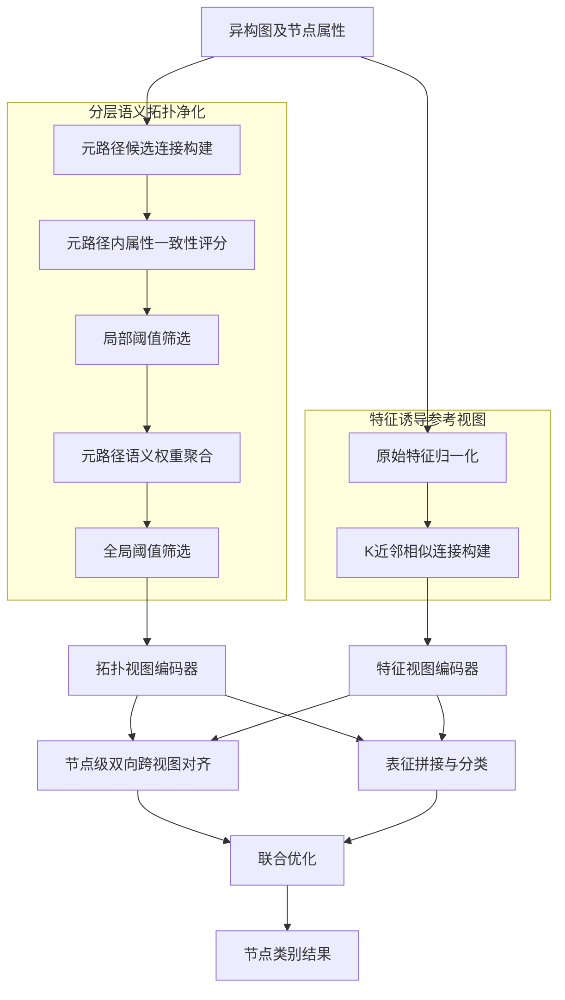
<!-- 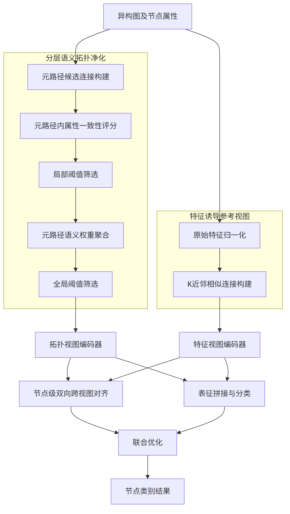 -->

图中，分层语义拓扑净化模块与特征诱导参考视图模块并行工作。两者输出分别输入相互独立或参数不共享的图编码器；编码器结果一方面用于分类，另一方面输入节点级双向跨视图对齐模块，并在联合优化时共同更新。

### 3.3 模块功能说明

#### （1）元路径候选连接构建模块

该模块从目标节点到目标节点的预设元路径集合中获得多个候选邻接矩阵。每个矩阵保留一种关系组合下可达的目标节点对，不直接把不同元路径的候选边混合，以便后续分别衡量其可信度。

#### （2）分层语义拓扑净化模块

该模块包括元路径内属性一致性评分、局部阈值筛选、元路径语义权重聚合和全局阈值筛选四个相互衔接的子模块。首先，利用相连目标节点的归一化原始属性计算候选边置信度；其次，在每个元路径内剔除低于对应局部阈值的连接；然后，根据当前任务对各元路径学习语义权重；最后，对聚合后的连接再执行全局阈值筛选。该两阶段处理避免只依据局部相似度保留任务无关边，也避免过早跨元路径混合噪声。

#### （3）特征诱导参考视图构建模块

该模块仅以目标节点的原始属性相似度建立 K 近邻连接，不以观测关系边是否存在作为建边条件。在仅攻击结构而不篡改原始属性的场景中，该视图可作为与受攻击拓扑相对独立的参考；在属性也存在不可靠情形时，可先对属性进行预处理或将该视图置信度调低。

#### （4）双视图编码与节点级对齐模块

该模块分别在净化拓扑视图和特征诱导参考视图上执行图编码，得到每个目标节点的两组嵌入。对齐模块把同一目标节点的两组嵌入作为正样本对，把批内或全体其他目标节点的跨视图嵌入作为负样本对，同时从两个视图方向计算对比损失。由此，净化拓扑视图学习到的关系结构与特征诱导视图提供的稳定参照相互约束。

#### （5）联合分类优化模块

该模块拼接或融合双视图嵌入完成节点分类，并将分类损失、双向对比损失和可选的辅助元路径语义学习损失进行联合优化。训练完成后，以分类输出作为目标节点的类别结果。

### 3.4 系统流程说明

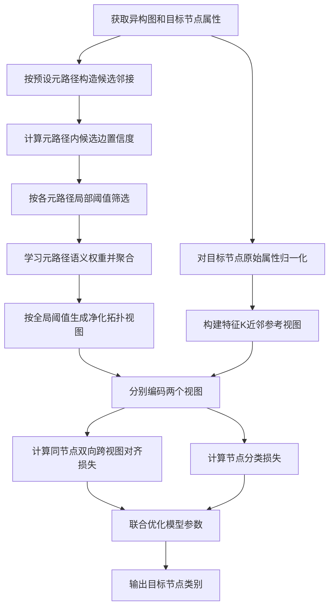
<!-- 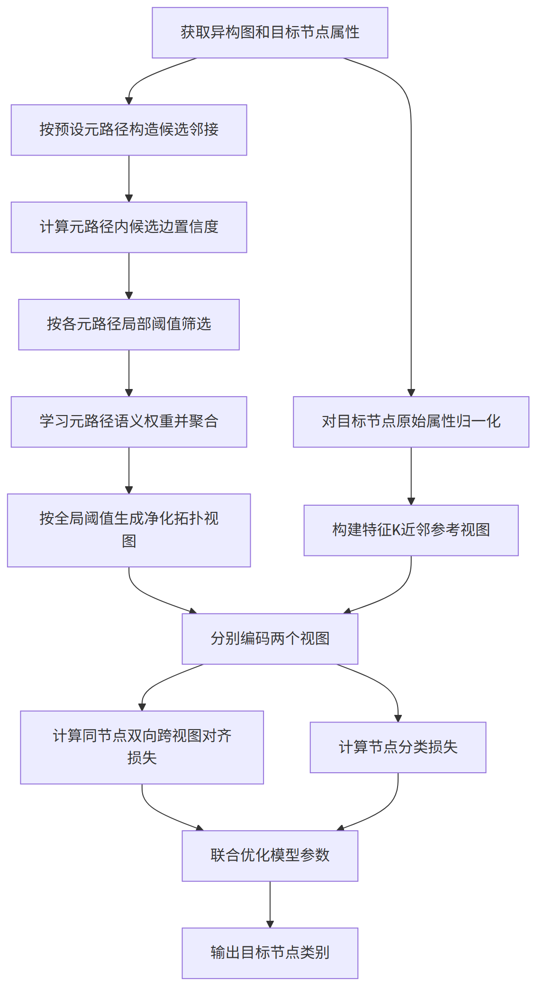 -->

流程中，S2 至 S6 形成拓扑证据的分层净化链；S7 至 S8 形成不基于观测边的特征证据链；S9 至 S12 将两类证据同时用于分类与表示一致性约束。局部阈值、全局阈值、近邻数和对比温度均通过验证集确定，而不以测试集结果选择。

### 3.4.1 符号与公式

#### （1）图、节点和元路径符号

| 符号 | 含义 | 下标/量纲 |
|---|---|---|
| (G=(V,E,\mathcal{T},\mathcal{R},X)\) | 输入异构图 | (V) 为节点集合，(E) 为观测边集合 |
| (V_t\) | 目标类型节点集合 | (t) 为预设目标节点类型 |
| (i,j\) | 目标节点索引 | (i,j\in V_t\) |
| (m\) | 元路径索引 | (m\in\{1,\ldots,M\}\) |
| (A^{(m)}\) | 元路径 (m) 的候选邻接矩阵 | 元素为非负可达计数或归一化连接强度 |
| (\tilde{x}_i\) | 节点 (i) 的归一化原始属性向量 | \(\|\tilde{x}_i\|_2=1\)<!-- 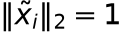 --> |

#### （2）净化和视图构造符号

| 符号 | 含义 | 下标/量纲 |
|---|---|---|
| (s_{ij}^{(m)}\) | 元路径 (m) 下候选连接 (i,j) 的属性一致性置信度 | 非负实数 |
| (d_i^{(m)}\) | 节点 (i) 在元路径 (m) 下的置信度度值 | 非负实数 |
| (w_{ij}^{(m)}\) | 归一化后的元路径内连接权重 | 非负实数 |
| (\gamma_m\) | 元路径 (m) 的局部筛选阈值 | \(0\leq\gamma_m\leq 1\)<!-- 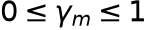 --> |
| (\beta_m\) | 元路径 (m) 的语义权重 | \(0\leq\beta_m\leq 1\)<!-- 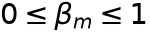 -->，且 \(\sum_m\beta_m=1\)<!-- 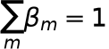 --> |
| (\gamma_s\) | 跨元路径聚合后的全局筛选阈值 | \(0\leq\gamma_s\leq 1\)<!-- 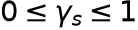 --> |
| (A^{\mathrm{topo}}\) | 净化拓扑视图的邻接矩阵 | 目标节点间非负连接 |
| (A^{\mathrm{feat}}\) | 特征诱导参考视图的邻接矩阵 | 目标节点间 K 近邻连接 |
| (K\) | 每个目标节点保留的特征近邻数 | 正整数 |

#### （3）编码和优化符号

| 符号 | 含义 | 下标/量纲 |
|---|---|---|
| (z_i^{\mathrm{topo}}\) | 节点 (i) 的净化拓扑视图嵌入 | 实向量 |
| (z_i^{\mathrm{feat}}\) | 节点 (i) 的特征诱导视图嵌入 | 实向量 |
| (\tau\) | 对比学习温度参数 | 正实数 |
| (\mathcal{L}_{\mathrm{cl}}\) | 节点级双向跨视图对齐损失 | 非负实数 |
| (\mathcal{L}_{\mathrm{cls}}\) | 节点分类损失 | 非负实数 |
| (\mathcal{L}_{\mathrm{aux}}\) | 可选辅助元路径语义学习损失 | 非负实数 |
| (\lambda_{\mathrm{cl}},\lambda_{\mathrm{aux}}\) | 损失权重 | 非负实数 |

首先，针对每条元路径，以目标节点对的归一化属性内积衡量候选边的一致性；当属性内积为负时，将其截断为零，避免负连接权重进入后续归一化。候选邻接矩阵可由关系邻接矩阵沿元路径相乘得到，也可由等价的元路径可达性计算获得：

\[
s_{ij}^{(m)}=A_{ij}^{(m)}\max\left(0,\tilde{x}_i^\top\tilde{x}_j\right)\tag{1}
\]
<!-- 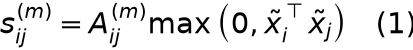 -->

对式（1）的置信度作对称归一化，其中 \(\epsilon\)<!-- 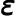 --> 为预设的极小正数，用于防止分母为零：

\[
d_i^{(m)}=\sum_{j\in V_t}s_{ij}^{(m)},\quad w_{ij}^{(m)}=\frac{s_{ij}^{(m)}}{\sqrt{\left(d_i^{(m)}+\epsilon\right)\left(d_j^{(m)}+\epsilon\right)}}\tag{2}
\]
<!-- 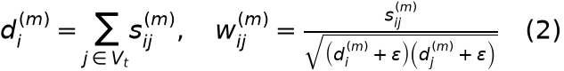 -->

在每个元路径内先进行局部筛选，再按照可学习的语义权重聚合，并实施全局筛选：

\[
\bar{A}_{ij}^{(m)}=\mathbb{I}\left(w_{ij}^{(m)}\geq\gamma_m\right)w_{ij}^{(m)},\quad A_{ij}^{\mathrm{topo}}=\mathbb{I}\left(\sum_{m=1}^{M}\beta_m\bar{A}_{ij}^{(m)}\geq\gamma_s\right)\sum_{m=1}^{M}\beta_m\bar{A}_{ij}^{(m)}\tag{3}
\]
<!-- 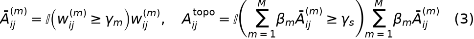 -->

这里，\(\mathbb{I}(\cdot)\) 为示性函数。\(\beta_m\)<!-- 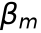 --> 可由对每个元路径编码结果进行语义注意力归一化得到，也可由验证集约束下的可学习参数得到。若某一元路径筛选后不存在有效候选连接，则其对应贡献置零，并在计算语义权重时跳过或赋予极小权重。

然后，仅由原始目标节点属性构造特征诱导参考视图。令 \(\mathcal{N}_K(i)\) 为 \(V_t\setminus\{i\}\)<!-- 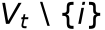 --> 中与节点 (i) 的余弦相似度最高的 (K\) 个节点集合，则：

\[
A_{ij}^{\mathrm{feat}}=\mathbb{I}\left(j\in\mathcal{N}_K(i)\right)\max\left(0,\tilde{x}_i^\top\tilde{x}_j\right)\tag{4}
\]
<!-- 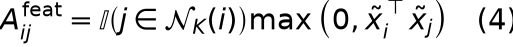 -->

可选地，将 \(A^{\mathrm{feat}}\)<!-- 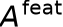 --> 与其转置取并集或取平均，形成无向参考视图。与 \(A^{\mathrm{topo}}\)<!-- 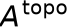 --> 相比，式（4）不依赖观测边集合 (E\)，因而在仅有结构扰动的应用条件下可提供相对独立的参考连接。

分别以图注意力网络、图卷积网络或其他消息传递网络编码两个视图，得到 \(z_i^{\mathrm{topo}}\)<!-- 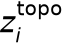 --> 和 \(z_i^{\mathrm{feat}}\)<!-- 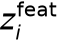 -->。令 \(B\subseteq V_t\)<!-- 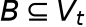 --> 为一个训练批次，使用余弦相似度 \(\operatorname{sim}(\cdot,\cdot)\) 构造同一节点正样本和不同节点负样本的双向对比损失：

\[
\mathcal{L}_{\mathrm{cl}}=-\frac{1}{2|B|}\sum_{i\in B}\left[\log\frac{\exp\left(\operatorname{sim}(z_i^{\mathrm{topo}},z_i^{\mathrm{feat}})/\tau\right)}{\sum_{j\in B}\exp\left(\operatorname{sim}(z_i^{\mathrm{topo}},z_j^{\mathrm{feat}})/\tau\right)}+\log\frac{\exp\left(\operatorname{sim}(z_i^{\mathrm{feat}},z_i^{\mathrm{topo}})/\tau\right)}{\sum_{j\in B}\exp\left(\operatorname{sim}(z_i^{\mathrm{feat}},z_j^{\mathrm{topo}})/\tau\right)}\right]\tag{5}
\]
<!-- 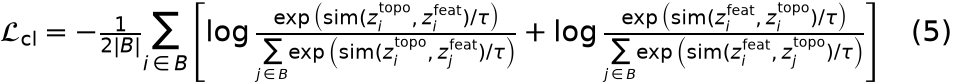 -->

将两个视图嵌入拼接或以注意力方式融合后进行分类，训练时使用下式联合优化：

\[
\mathcal{L}=\mathcal{L}_{\mathrm{cls}}+\lambda_{\mathrm{cl}}\mathcal{L}_{\mathrm{cl}}+\lambda_{\mathrm{aux}}\mathcal{L}_{\mathrm{aux}}\tag{6}
\]
<!-- 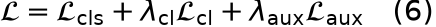 -->

其中，\(\mathcal{L}_{\mathrm{aux}}\)<!-- 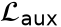 --> 可由元路径语义编码器的辅助分类任务产生；不采用辅助任务时取 \(\lambda_{\mathrm{aux}}=0\)<!-- 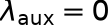 -->。在部署阶段，仅需保留得到的双视图建图、编码、融合和分类过程。

### 3.5 关键技术参数

| 参数 | 符号 | 作用 | 设置方式 |
|---|---|---|---|
| 元路径局部筛选阈值 | (\gamma_m\) | 剔除元路径内低属性一致性连接 | 可按元路径独立设置，并由验证集选择 |
| 全局筛选阈值 | (\gamma_s\) | 剔除语义聚合后仍低可信的连接 | 由验证集选择 |
| 语义权重 | (\beta_m\) | 平衡不同元路径的任务相关性 | 注意力归一化或可学习归一化参数 |
| 特征近邻数 | (K\) | 控制特征诱导参考视图的稀疏度 | 正整数；优选在 5 至 50 范围内搜索 |
| 对比温度 | (\tau\) | 控制正负样本相似度分布的平滑程度 | 正实数；优选在 0.05 至 1 的范围内选择 |
| 对比损失权重 | (\lambda_{\mathrm{cl}}\) | 平衡分类目标与跨视图一致性目标 | 非负实数；由验证集选择 |
| 辅助损失权重 | (\lambda_{\mathrm{aux}}\) | 平衡主分类与辅助语义学习 | 非负实数；不使用辅助任务时为 0 |

## 四、与现有技术相比，本发明具有哪些优点？

（1）本发明以元路径内属性一致性和元路径间语义重要性进行两阶段净化，使候选连接需同时满足局部可信和全局任务相关要求，降低单次筛选遗漏或误保留低可信连接的概率。

（2）本发明构造不以观测边集合 (E) 作为建图依据的特征诱导参考视图。在结构攻击而原始属性可用的条件下，该参考视图可以减少受攻击邻域对表示学习的单一支配，补充净化拓扑视图的证据来源。

（3）本发明采用以同一节点为正样本的双向跨视图对齐。该约束不是泛化的随机视图增强，而是直接校验同一节点在“净化拓扑证据”和“属性诱导证据”下的表示一致性，适用于结构扰动导致的表示偏移抑制。

（4）本发明的模块可替换性较强。元路径语义权重可以由不同注意力机制产生，双视图编码器可以采用不同消息传递网络，分类器可以采用线性层或多层感知器，而不改变分层净化、特征参考和节点级对齐的核心技术链条。

## 五、本发明的技术关键点和欲保护点是什么？

（1）一种用于异构图节点分类的双证据协同方法：针对目标节点，基于元路径构建候选连接并进行分层语义拓扑净化，同时基于原始目标节点属性构造不依赖观测边的特征诱导参考视图；分别编码两个视图，并按同一节点进行双向跨视图对齐后实施节点分类。

（2）元路径内与元路径间的两阶段净化：先按候选连接两端的原始属性一致性对每个元路径独立筛选，再使用元路径语义权重聚合保留连接，并按聚合结果进行全局筛选。具体可采用式（1）至式（3）的置信度和阈值实现。

（3）面向结构扰动的特征诱导参考视图：仅按目标节点原始属性的 K 近邻关系构图，不以观测关系边作为建边前提；该视图与净化拓扑视图共同参与后续编码和分类。

（4）节点级对称跨视图对齐：以同一目标节点的两个视图嵌入为正样本对，并分别从净化拓扑视图指向特征诱导视图、从特征诱导视图指向净化拓扑视图计算对比损失；以不同节点的跨视图嵌入构成负样本对，具体可采用式（5）。

（5）联合优化方式：基于两个视图嵌入的融合结果计算分类损失，并联合双向对比损失和可选辅助元路径语义学习损失训练模型，具体可采用式（6）。

（6）以下内容宜作为从属保护的可选限定：属性一致性采用非负余弦相似度；局部阈值 \(\gamma_m\)<!-- 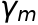 --> 按元路径分别设置；特征 K 近邻视图采用有向、无向或加权连接；语义权重 \(\beta_m\)<!--  --> 由注意力网络生成；两个视图编码器参数不共享。

## 六、其它

### 实施例

在一个学术信息网络的节点分类场景中，将论文、作者和研究主题等抽象为不同节点类型，将发表、主题关联等抽象为关系类型，选取论文节点为目标节点。预设两条或多条从论文节点出发并回到论文节点的元路径，按式（1）至式（3）生成净化拓扑视图。对论文节点的文本或属性特征进行归一化，按式（4）建立每个节点的特征 K 近邻参考视图。

在一个实施方式中，特征近邻数 \(K\)<!-- 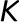 --> 可设为 20，局部阈值 \(\gamma_m\)<!--  -->、全局阈值 \(\gamma_s\)<!-- 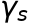 -->、对比温度 \(\tau\)<!-- 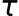 --> 以及 \(\lambda_{\mathrm{cl}}\)<!-- 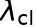 --> 均在验证集上选取。两个视图分别采用图注意力编码器，输出嵌入拼接后输入分类器；训练阶段按式（5）和式（6）共同优化。上述参数仅为实施示例，不构成对保护范围的限制。

当观测图中存在边插入、边删除或边重连导致的结构扰动时，分层语义拓扑净化先抑制属性不一致或跨元路径语义贡献较低的候选连接；特征诱导参考视图再向同一节点提供不基于观测边的表示参照；节点级双向对齐促使两个视图的有效信息相互保持一致。由此，可在统一训练和评估协议下比较节点分类准确率及其在不同结构扰动强度下的变化，以验证本发明在结构扰动条件下的稳定性。
